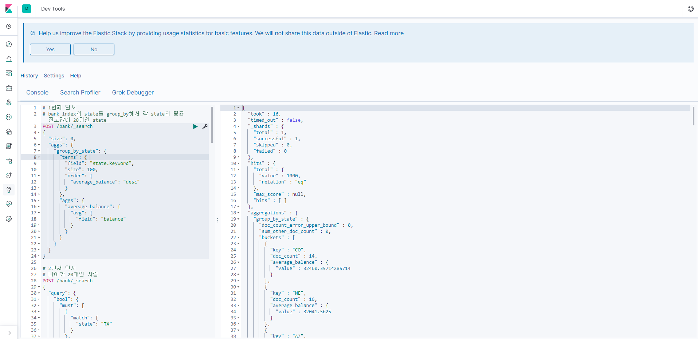

# ElasticSearchMiniProject
엘라스틱 서치에서 쿼리를 통해 데이터 핸들링

# 팀원
강민웅 [강민웅님의 깃허브 바로가기](https://github.com/happymwkang) 
김수경 [김수경님의 깃허브 바로가기](https://github.com/sooish) 
김웅태 [김웅태님의 깃허브 바로가기](https://github.com/angle2v) 
김종성 [김종성님의 깃허브 바로가기](https://github.com/SEJSCloud) 

# 사용 기술셋
NoSql DB : ElasticSearch  
Development Language : Elastic Search Query  
Tool : Kibana, Postman 

# 개발 환경

Window 10  
Elastic Search 7.1.1  
Kibana 7.1.1  

# 키바나 쿼리 시연
</img>

### 데이터
[엘라스틱서치 제공 account.json데이터](https://raw.githubusercontent.com/elastic/elasticsearch/master/docs/src/test/resources/accounts.json)
